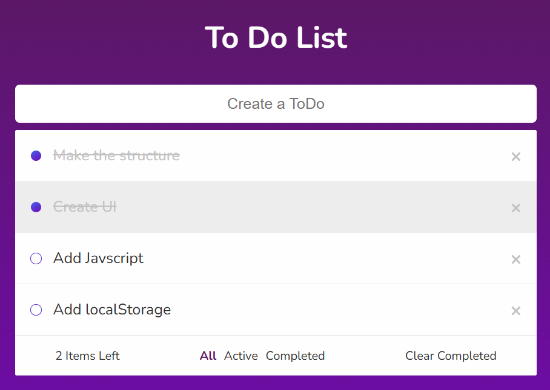

# To-Do List with Vanilla JavaScript

A minimalist to-do list application developed entirely with vanilla JavaScript, without external dependencies. Perfect for efficiently organizing your daily activities.

## 📸 Demo

Try the [Online Version](google.com)



## 💡 Usage

1. Write a task in the text field
2. Press Enter
3. To mark a task as completed, click on the checkbox
4. To delete a task, click on the delete icon
5. Drag and drop tasks to reorder them

## 💾 Main Features

- **Task Management**
  - Create new tasks
  - Mark tasks as completed
  - Delete tasks
- **Drag and Drop**: Reorder your tasks by dragging them
- **Data Persistence**: Local storage using localStorage
- **Responsive Design**: Intuitive interface adaptable to different devices

## 🚀 Installation

1. Clone the repository:

```bash
git clone https://github.com/Asaad-E/TodoList-Vanilla.git
```

2. Navigate to the project directory:

```bash
cd TodoList-Vanilla
```

3. Open the `index.html` file in your preferred browser.

## 🛠️ Technologies Used

- HTML5
- CSS3
- JavaScript (ES6+)
